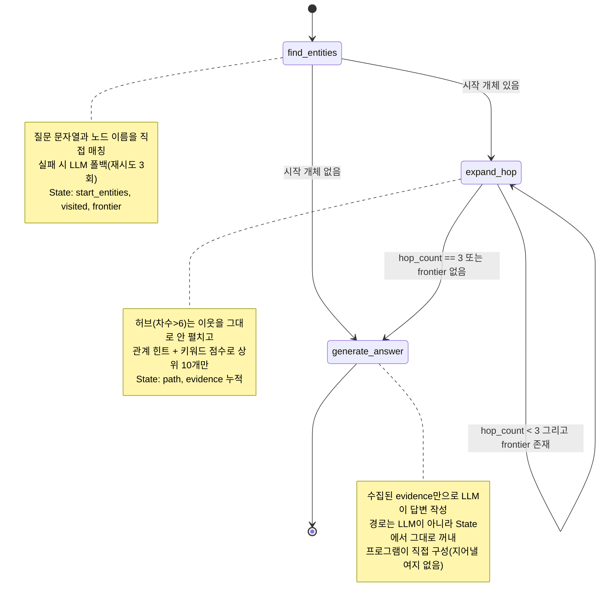
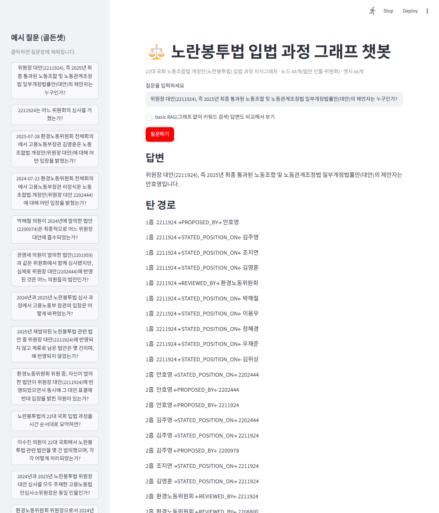
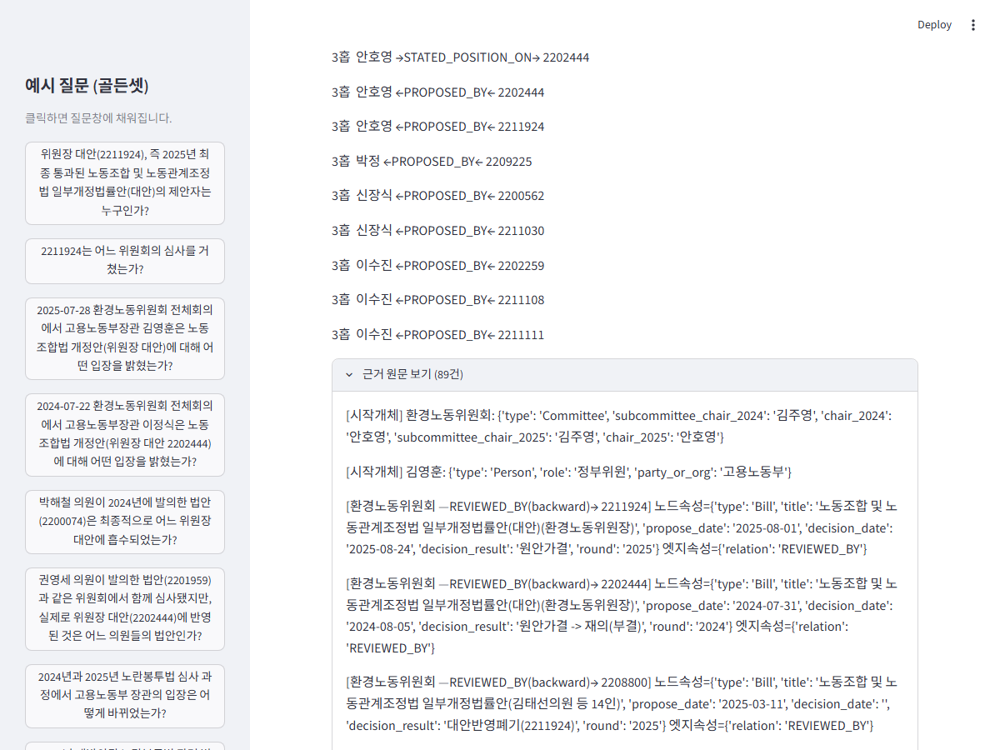

# REPORT — 노란봉투법 입법 과정 지식그래프 챗봇

## 사용한 외부 데이터 출처 (참고용 요약)

| 출처 | 용도 | 실제 사용한 서비스ID / 경로 |
|---|---|---|
| [열린국회정보 Open API](https://open.assembly.go.kr/portal/openapi/openApiIntroPage.do) | 법안 검색·상세·제안이유, 위원회 심사 정보, 국회의원 인적사항 | `TVBPMBILL11`(의안검색), `BILLINFODETAIL`(처리경과), `BPMBILLSUMMARY`(제안이유·주요내용), `TVBPMCONFINFO`(소위 심사정보), `nwvrqwxyaytdsfvhu`(국회의원 인적사항, 문서화 안 돼 있어 사이트에서 직접 찾음) |
| [국회도서관 발언 빅데이터](https://dataset.nanet.go.kr) | 회의록 발언 전문 검색·수집 | 홈 검색창(`srchQ`) → 결과 카드(`selectMeetingDetail(conferNum)`) 클릭 → 발언 목록. `데이터셋 다운로드` 기능(전체 발언 export)은 존재만 확인, 자동화는 안 함(아래 "알려진 한계" 참고) |
| [의안정보시스템](https://likms.assembly.go.kr) | 의안번호·발의자·처리결과 1차 확인(수동) | `data/seed_bills.json`의 근거 |
| 웹 검색 | 정부위원(장관·차관) 프로필, 동명이인 확인 | `data/docs/people/*.md` 중 정부위원 4명 |

`data.go.kr`(공공데이터포털) 키는 시도했으나 이 프로젝트에서는 불필요했다(권한 없는 서비스였음). 상세 경위는 1장·`data/RESEARCH_NOTES.md` 참고.

---

## 1. 주제와 코퍼스

### 왜 이 주제인가

22대 국회의 "노동조합 및 노동관계조정법 개정안"(통칭 노란봉투법)을 도메인으로 골랐다. 이 주제를 고른 이유는 세 가지다.

1. **개체가 자연스럽게 겹친다.** 22대 국회에서만 이 법안 이름으로 48건이 발의됐다. 여러 의원이 각자 발의한 유사 법안이 위원장 대안으로 병합 심사되기 때문에, "같은 법안을 여러 사람이 발의한다", "여러 법안이 하나로 합쳐진다" 같은 멀티홉 질문의 소재가 저절로 생긴다.
2. **여야 입장차와 결과가 뚜렷하다.** 2024년(원안 통과 후 대통령 거부권 → 폐기)과 2025년(정권 교체 후 통과·공포)까지 두 라운드가 완결돼 있어서 골든셋 정답이 흔들리지 않는다.
3. **정부 입장이 뒤집힌 증거가 회의록에 그대로 남아 있다.** 2024년 고용노동부 장관 이정식은 반대했고, 2025년 장관 김영훈은 지지했다. 같은 절차(법안 의결 직후 정부 인사말)에서 나온 발언이라 직접 대조가 가능하다 — 이게 골든셋의 핵심 문항(멀티홉-03)이 됐다.

코퍼스 기간은 22대 국회 개원(2024-05-30)부터 노란봉투법 공포일(2025-09-09)까지로 한정했다. 21대 국회의 1차 시도(2023년, 대통령 거부권)와 2026년 시행 이후 나온 완화 개정 시도는 범위 밖으로 뒀다 — 스코프를 넓히면 코퍼스가 불필요하게 커지고 골든셋의 초점이 흐려지기 때문이다.

### 코퍼스: 몇 건을, 어떻게 모았는가

**총 51건** (법안 원문 19 + 회의록 발언 전문 5 + 인물 프로필 27).

| 종류 | 건수 | 수집 방법 |
|---|---|---|
| 법안 원문 | 19 | 열린국회정보 API(`BPMBILLSUMMARY`)로 제안이유·주요내용 전문 수집 |
| 회의록 발언 전문 | 5 | 국회도서관 발언 빅데이터(dataset.nanet.go.kr)에서 회의별 발언자 전체 발언을 Playwright로 자동 수집 (총 2,144개 발언) |
| 인물 프로필 | 27 | 국회의원 23명은 열린국회정보 API(`nwvrqwxyaytdsfvhu`, 국회의원 인적사항)로 자동 수집. 장관·차관 4명은 이 API가 국회의원 DB라 커버가 안 돼 웹 검색으로 직접 작성 |

**채택 기준**: 같은 위원회(환경노동위원회) 소관, 같은 의안명으로 여러 의원이 각각 발의(개체 중복 보장), 병합심사(대안반영폐기) 이력이 있어 병합 관계를 실증할 수 있는 사례, 정부위원 발언이 뉴스로 교차 확인되는 사례.

**탈락 기준**: 2025년 재발의된 법안 중 4건(윤재옥·윤종오·송옥주·박해철 각 1건)은 같은 의안명을 쓰지만 원문을 직접 대조해 보니 노란봉투법의 핵심 쟁점(사용자 범위 확대·손해배상 제한)과 무관한 별개 주제(노조 회계투명성, 교섭창구단일화 폐지, 노무관리진단보고서, 노조 결산공개 완화)였다. 코퍼스에는 포함해서 "같은 이름이지만 다른 법안"의 대조 사례로 남겨 뒀다.

**API 관련 실수와 정정**: 처음 시도한 열린국회정보 서비스ID(`ALLBILL`)는 실제로 동작하지 않았다. 사이트를 직접 뒤져서 진짜 서비스ID(`TVBPMBILL11`, `BILLINFODETAIL`, `BPMBILLSUMMARY`, `TVBPMCONFINFO`, `nwvrqwxyaytdsfvhu`)를 찾아 교체했다. `data.go.kr` 쪽 키는 애초에 필요 없었다(권한이 없는 서비스였음).

---

## 2. 골든셋과 스키마

### 스키마 (`config.json`)

- **노드 3종**: Bill(법안), Person(국회의원+정부위원, role 속성으로만 구분), Committee(위원회)
- **관계 3종**: `PROPOSED_BY`(Bill→Person, 발의), `REVIEWED_BY`(Bill→Committee, 심사), `STATED_POSITION_ON`(Person→Bill, 입장 표명)
- **최대 3홉**

### 뽑지 않기로 한 관계와 그 이유

| 안 뽑은 것 | 이유 | 대가 |
|---|---|---|
| Bill–Bill 관계(예: `MERGED_INTO`) | 위원회 허브를 경유하는 2~3홉으로 충분히 표현 가능해서, 스키마를 넓힐 실익이 없다고 판단 | "실제로 병합됐는지"를 그래프 구조만으로는 증명 못 함 → 3장에서 실제로 겪은 문제로 다시 나옴 |
| 위원장·소위원장의 절차 발언(개의/상정/산회 선언) | 위원장 한 명이 회의 때마다 다루는 모든 법안에 절차 발언을 하므로, 이걸 다 뽑으면 위원장 노드가 거대 허브가 돼서 그래프가 무의미해짐 | "누가 위원장이었나"를 관계로는 답할 수 없음 → 이 역시 3장에서 실제로 부딪힘 |

### 골든셋: 13문항

| 유형 | 문항 수 | 예시 |
|---|---|---|
| 단순 (1홉) | 4 | "위원장 대안(2211924)의 제안자는 누구인가?" |
| 멀티홉 (2~3홉) | 5 | "박해철 의원이 2024년에 발의한 법안(2200074)은 최종적으로 어느 위원장 대안에 흡수되었는가?" |
| 전역 (문서 종합) | 4 | "노란봉투법의 22대 국회 입법 과정을 시간 순서대로 요약하면?" |

문항마다 기대 정답, 최소 삼중항 경로(`reference_contexts`), 추론 경로 설명(`chain`), 원문 근거(`evidence`)를 기록했다. 두 가지를 특별히 넣었다:

- **함정 문항** (멀티홉-04): "같은 위원회를 거쳤다"는 사실만으로 "병합됐다"고 답하면 틀리는 사례. 실제로 같은 위원회를 거쳤지만 병합 안 되고 계류로 남은 법안이 있기 때문.
- **거절 문항** (멀티홉-05): "그런 사람이 있는가?"에 대한 정답이 "없다"인 문항. 근거 없이 답을 지어내지 않는지 확인하는 용도.

작성 중 문항 2개(원래 소위원장/위원장 "동일 인물인가" 질문을 멀티홉으로 분류했었음)가 스스로 정한 규칙(절차 발언은 관계로 안 뽑는다)을 위반하고 있다는 걸 발견해서, `전역`(문서를 직접 대조해야 하는 질문)으로 재분류했다 — 이 경위 자체를 note 필드에 남겨 뒀다.

---

## 3. 파이프라인 구조도

```mermaid
flowchart TB
    subgraph collect["1. 자료 수집"]
        api1["열린국회정보 API"] --> bills["data/docs/bills (19)"]
        api2["국회도서관 발언 빅데이터"] --> meetings["data/docs/meetings (5)"]
        api1 --> people["data/docs/people (27)"]
    end

    subgraph build["2. build_graph.py"]
        det["결정론적 추출<br/>PROPOSED_BY · REVIEWED_BY<br/>(seed_bills.json 파싱)"]
        llm1["LLM 추출<br/>STATED_POSITION_ON<br/>(회의당 1회 호출)"]
        norm["정규화<br/>· 위원장 대안 제안자 별칭 병합<br/>· decision_result에 대안 번호 명시<br/>· 위원회 노드에 chair 속성 추가"]
        det --> norm
        llm1 --> norm
    end

    collect --> det
    collect --> llm1
    norm --> graph[("output/graph.graphml<br/>노드 44 · 엣지 66")]

    graph --> agent["3. agent.py (LangGraph)"]
    graph --> eval["4. evaluate.py"]
    agent --> eval
    agent --> app["5. app.py (streamlit)"]
```

### agent.py의 LangGraph 상태 흐름



State는 `question`, `graph`, `start_entities`, `visited`, `frontier`, `hop_count`, `path`, `evidence`, `answer` 필드로 구성된다. `path`와 `evidence`는 각 노드가 반환하는 부분 업데이트가 계속 누적되는 방식이라, 최종적으로 "실제로 탄 경로"를 그대로 사용자에게 보여줄 수 있다.

---

## 4. 측정 결과

### 홉 수별 basic RAG 대조표

| 홉 | 그래프 에이전트 | basic RAG | 경로 재현율 |
|---|---|---|---|
| 1홉 | 5/6 | 0/6 | 100% |
| 2홉 | 2/3 | 1/3 | 90% |
| 3홉 | 0/1 | 0/1 | 100% |
| 전역 | 2/3 | 0/3 | N/A |
| **전체** | **9/13** | **1/13** | |

basic RAG는 그래프 없이 질문과 키워드가 겹치는 문서 상위 5개만 주고 답하게 한 것이다(비교용 베이스라인). **1홉 질문에서 basic RAG가 0/6인 것이 가장 뚜렷한 신호다** — "누가 제안했는가" 같은 관계형 질문은 키워드 검색만으로는 원천적으로 못 푼다. 반면 그래프는 정확한 노드·엣지 하나만 찾으면 되므로 5/6을 맞혔다.

basic RAG의 약점 하나를 짚어두면: 긴 회의록(예: 053920.md, 17만자)을 앞 1,500자만 잘라 컨텍스트로 주다 보니, 정작 필요한 내용이 문서 뒷부분에 있으면(실제로 그랬다 — 노동법 표결은 그 문서의 맨 끝 4%에 있었다) 통째로 놓친다.

### 실패의 층 분류 (색인·탐색·생성)

세션 초반(1차 평가)에는 6/13이었다. 실패를 색인·탐색·생성으로 나눠 원인을 하나씩 진단하고 고친 뒤 재평가해서 9/13까지 올렸다. 아래는 그 과정에서 실제로 겪은 문제들이다.

#### 사례 1 — 탐색 실패: "먼저 온 사람이 자리를 차지해버리는" 버그

**증상**: "2025-07-28 회의에서 김영훈 장관은 어떤 입장이었나?"라는 1홉짜리 쉬운 질문에 "코퍼스에서 확인되지 않습니다"라고 오답.

**원인**: 이 질문에는 시작 개체가 두 개 잡힌다 — "환경노동위원회"와 "김영훈". 확장 로직이 이 둘을 순서대로 처리하는데, 먼저 처리되는 "환경노동위원회"가 법안 2211924를 이웃으로 추가하면서 그 노드를 "방문 완료"로 표시해버렸다. 그다음 "김영훈"을 처리할 차례가 왔을 때, 김영훈의 유일한 이웃도 마침 2211924였는데 — 이미 "방문 완료"로 찍혀 있으니 "더 볼 필요 없다"고 건너뛰어 버린 것이다. 정작 김영훈이 2211924에 대해 뭐라고 말했는지(`STATED_POSITION_ON`, 우리가 찾던 바로 그 사실)는 근거 목록에 추가되지도 못하고 사라졌다.

**교훈**: "이 노드를 더 확장할지"와 "이 노드로 가는 이 엣지를 기록할지"는 서로 다른 질문인데, 하나의 `visited` 집합으로 뭉뚱그려 처리하고 있었다. 같은 홉 안에서 여러 출발점이 하나의 목적지를 서로 다른 관계로 가리킬 때만 드러나는 버그라서, 단일 질문으로 테스트할 때는 안 걸리고 골든셋 전체를 자동으로 돌릴 때 비로소 드러났다.

**수정**: "재확장 방지용 방문 처리"와 "엣지 기록"을 분리했다. 엣지는 `(출발, 관계, 도착, 방향)` 단위로 별도 중복 체크만 하고, 이미 방문한 노드로 가는 새로운 관계라도 기록은 항상 한다.

#### 사례 2 — 색인 실패: 이름이 안 나오는 질문

**증상**: "2024년과 2025년 위원장 대안 심사를 모두 주재한 소위원장은 동일 인물인가?"라는 질문에 "시작 개체를 찾지 못해 답할 수 없습니다."

**원인**: 에이전트가 그래프 탐색을 시작하려면 먼저 "이 질문이 그래프의 어느 노드 얘기인지"부터 정해야 하는데, 그 방법이 **"질문 문장 안에 그래프에 있는 이름(법안번호, 사람 이름, 위원회 이름)이 그대로 적혀 있는지만 본다"**는 단순한 문자열 매칭 하나뿐이었다. 그런데 이 질문("동일 인물인가?")은 애초에 이름을 몰라서 묻는 질문이다 — 법안번호도, 사람 이름도, 위원회 이름도 문장 어디에도 없다. 그러니 매칭될 이름이 원천적으로 없고, 에이전트는 "어디서부터 찾아야 할지" 정하지 못한 채 바로 포기해버린 것이다.

**수정**: 문자열 매칭이 실패하면 LLM에게 "이 질문은 그래프의 어느 노드에서 시작해야 하나?"를 노드 목록과 함께 물어보는 폴백을 추가했다. 여기서 또 하나의 특성을 발견했는데, 이 LLM 호출이 `temperature=0`인데도 완전히 결정적이지 않았다 — 같은 질문을 5번 반복하면 1번 정도는 빈 결과를 반환했다. 재시도 3회를 넣어서 실패율을 낮췄다(0으로 만들지는 못함).

#### 사례 3 — 색인 실패: 스키마에 아예 없는 사실

**증상**: "환경노동위원회 위원장으로서 2024·2025년을 모두 주재한 인물은?"에 답을 못 함.

**원인**: 2장에서 이미 "위원장의 절차 발언은 관계로 안 뽑는다"고 정했기 때문에, 애초에 그래프 어디에도 "누가 위원장이었나"라는 사실 자체가 없었다.

**수정**: 관계를 늘리는 대신, 위원회 노드에 `chair_2024`, `chair_2025`, `subcommittee_chair_2024` 같은 **속성**을 한 줄씩 추가했다(회의록 헤더에서 "위원장 OOO" 패턴만 뽑으면 되는 가벼운 작업). 스키마는 그대로 두고 정규화 단계에서 정보만 보강한 사례다.

#### 사례 4 — 탐색 실패: 허브를 지날 때 "양자택일"의 함정

**증상**: "재발의된 법안 중 위원장 대안에 반영 안 되고 계류로 남은 건 몇 건인가?"에 오답.

**원인**: 질문에 "재발의"라는 단어가 있어서 에이전트가 "이건 PROPOSED_BY(발의자) 관계를 묻는 질문이구나"라고 판단하고, 허브 노드(법안 2211924, 이웃 15개)를 지날 때 PROPOSED_BY 관계만 남기고 나머지(REVIEWED_BY 등)는 전부 버렸다. 그런데 이 질문은 사실 REVIEWED_BY(위원회를 거쳤는지)가 정답의 핵심이었다 — 관계 힌트가 "이것만 보고 나머지는 버려"라는 양자택일 방식이었던 게 문제였다.

**수정**: "힌트에 맞는 관계를 우선 채우되, 자리가 남으면 다른 관계도 채운다"는 방식으로 바꿨다.

#### 사례 5 — 한국어 특유의 문제: 조사가 단어에 붙는다

같은 문항을 고치다가 두 번째 문제를 발견했다: 법안 속성에는 `"계류, 다른 방향..."`이라고 적혀 있는데 질문에는 "계류**로** 남은"이라고 조사가 붙어 있어서, 정확한 문자열 비교로는 "계류"와 "계류로"가 다른 단어로 취급됐다. 자주 쓰는 조사(로/은/는/을/를 등)를 미리 떼어내는 가벼운 보정을 추가했다.

이 두 가지를 고친 뒤에도, 우연히 정답 법안 번호(`2211924`)가 **오답** 후보들의 속성 텍스트에도 등장해서 점수가 더 높게 나오는 부작용이 남았다("~에 반영됨(2211924)"과 "~와 무관함"을 텍스트만 보고는 구분 못 함). 허브를 지날 때 남기는 후보 수를 6개에서 10개로 늘려서 우회했다 — 근본적인 해결은 아니고 밀려날 여지를 줄인 수준이다.

#### 사례 6 — 생성 실패: 근거가 완벽해도 LLM이 종합을 못 함

사례 4·5를 고친 뒤 다시 확인해보니, 필요한 법안 4건의 `decision_result`(계류 여부)와 발의자 정보가 근거 목록에 전부 정확하게 들어와 있었다. 그런데도 최종 답변은 여전히 "확인되지 않습니다"였다. **문제의 위치가 탐색에서 생성으로 완전히 옮겨간 것이다.** 답변 프롬프트에 "decision_result를 하나씩 대조하라"고 구체적으로 지시해봤지만 고쳐지지 않았다 — 흩어진 근거 여러 줄(법안 4개 × 각각의 속성)을 종합해서 결론 내는 능력이 `gpt-4o-mini` 수준에서는 부족하다는, 프롬프트로는 못 넘는 한계로 보고 있다.

#### 사례 7 — 평가 자체의 함정: 판정관도 틀릴 수 있다

**증상**: "이수진 의원이 법안을 몇 건 발의했나?" 문항에서 채점을 맡은 LLM 판정관이 오답 처리.

**중요**: 여기서 틀린 건 **에이전트가 아니라 채점하는 쪽**이다. 에이전트 답변은 내용이 사실 정답이었다 — 3건 발의, 처리 결과(계류 1건·대안반영폐기 2건)까지 전부 정확했다.

**원인**: 골든셋 기대 정답은 법안을 **의안번호**로 구분해서 적어 뒀다("2024년 2202259(계류)... 2025년 2211108·2211111(대안반영폐기)"). 그런데 에이전트는 같은 법안들을 **법안 제목 + 발의일**로 구분해서 설명했다("발의일: 2024-07-25 → 계류", "발의일: 2025-06-26 → 대안반영폐기" 등). 가리키는 법안도, 처리 결과도 완전히 같은데 **식별 방식만 다른 것**이다. 그런데 판정관은 이걸 문자 그대로 비교하다가 "법안 제목과 발의일이 정답과 다르다"며 서로 다른 사실을 말하는 것처럼 오판했다 — 같은 법안을 가리키는 다른 표현이라는 걸 인식하지 못한 것.

**수정 시도**: 판정 프롬프트에 "식별 방식이 달라도 같은 사실을 가리키면 정답으로 인정하라"는 규칙을 명시적으로 추가했다. 그런데 이 문항에서는 그래도 고쳐지지 않았다 — 판정관 역할을 맡은 LLM도 완벽하지 않다는 뜻이다.

**교훈**: **자동 채점 결과(9/13)를 그대로 믿지 않고, 오답으로 나온 항목은 사람이 원문을 직접 확인해야 한다**는 것 자체가 이번 평가에서 얻은 결론이다(수동 확인 시 실질 10/13).

### 최종 결과 요약

| 항목 | 값 |
|---|---|
| 자동 채점 정답률 (그래프) | 9/13 |
| 수동 확인 후 실질 정답률 | 10/13 (판정관 오류 1건 보정) |
| basic RAG 정답률 | 1/13 |
| 남은 오답 4건의 실패 단계 | 자동 분류상 전부 생성 단계 — 그중 3건은 실제 생성 한계, 1건은 판정관 오류(사례 7) |
| 평가 자체의 변동폭 | evaluate.py를 연달아 두 번 돌리면 8~9/13 사이로 ±1 흔들림 (LLM 개체 링킹의 비결정성 때문) |

---

## 5. 데모 설계

`app.py`는 streamlit 한 페이지로 구성했다.

- **질문 입력 + 사이드바 예시**: 골든셋 13문항을 사이드바 버튼으로 두고, 클릭하면 질문창에 바로 채워지게 했다. 뭘 물어봐야 할지 막막하지 않게 하려는 목적.
- **답변 → 탄 경로 → 근거 순서로 보여준다.** 경로는 "1홉 2211924 →PROPOSED_BY→ 안호영" 같은 텍스트 목록이다. 그래프 시각화 라이브러리(plotly 등)를 쓸지 고민했지만, 노드 44개 규모에서는 텍스트 목록이 그림보다 오히려 빨리 읽히고 새 의존성도 안 늘어서 이 방식으로 정했다 — 나중에 그래프가 커지면 그때 다시 검토하면 된다.
- **근거는 기본적으로 접어 둔다.** 문항에 따라 근거가 최대 100건 가까이 나오는데, 전부 펼쳐서 보여주면 답변보다 먼저 근거 더미에 압도된다.
- **basic RAG 비교 체크박스**: 그래프 기반 답변과 나란히, 그래프 없이 키워드 검색만으로 뽑은 답변도 볼 수 있게 했다. 4장에서 정리한 "그래프가 왜 유리한가"를 화면에서 바로 체감할 수 있다.

**로컬 실행 확인**: `streamlit run app.py`로 서버를 띄우고 Playwright로 직접 질문을 클릭·제출해서 답변·경로·근거·RAG 비교가 전부 정상 렌더링되는 걸 확인했다.

**화면 캡처 — 답변 + 경로**



**화면 캡처 — 근거 펼친 화면**



---

## 6. 프로젝트 회고

### 가장 공들인 부분

**회의록에서 실제 발언 원문을 확보한 것**이다. 처음엔 국회 공식 회의록시스템(record.assembly.go.kr)의 검색 폼이 JS 아코디언 뒤에 숨어 있어 자동화에 실패했다. 포기하지 않고 대안(국회도서관 발언 빅데이터)을 찾아 자동화에 성공했고, 그 결과 2024년 이정식 장관의 반대 발언과 2025년 김영훈 장관의 지지 발언을 원문 그대로 확보할 수 있었다. 이게 없었으면 "정부 입장이 정권 교체로 뒤집혔다"는 이 프로젝트의 핵심 서사가 근거 없는 주장에 그쳤을 것이다.

**평가를 실제로 실행해서 버그를 찾아낸 것**도 의미가 크다. 수동으로 6개 질문을 테스트했을 때는 전부 정답이었지만, 골든셋 13문항을 자동으로 돌리자 점수가 6/13으로 뚝 떨어졌다. "여러 시작 개체가 동시에 있을 때"처럼 수동 테스트로는 우연히 안 걸리는 조합에서 실제 버그가 드러났다 — 평가 자동화 없이는 절대 못 찾았을 문제들이다.

### 향후 보완하고 싶은 점

1. **생성 단계의 한계**(6장 사례 6)를 넘으려면, 흩어진 근거를 LLM에게 그냥 텍스트로 던지는 대신 미리 구조화해서(예: "후보 법안별 처리결과 표"를 프로그램이 직접 조립해서) 주는 방식으로 바꾸거나, 더 큰 모델을 써야 한다.
2. **개체 링킹의 비결정성**(사례 2)과 **LLM 판정관의 오류**(사례 7)는 둘 다 "LLM 호출 하나에 전부 의존하지 말라"는 같은 교훈을 준다. 개체 링킹은 임베딩 기반 매칭이나 더 안정적인 모델로, 판정관은 다수결 채점이나 사람 검수 단계 추가로 보완하는 게 근본적인 해법이다. 지금은 재시도로 완화만 했다.
3. **Bill-Bill 병합 관계**를 아예 안 뽑기로 한 결정(2장)은 스키마를 단순하게 유지하는 데는 성공했지만, `decision_result`에 대안 번호를 수동으로 채워 넣는 정규화가 없었다면 에이전트가 이 사실에 아예 접근할 수 없었다. 코퍼스 규모가 커지면 이런 수동 보강이 안 통할 수 있어서, 관계를 늘리는 것도 다시 고려해볼 만하다.
4. **회의록 자동 수집이 회의당 화면에 렌더링된 발언까지만 가져온 건, 사이트의 한계가 아니라 우리 수집 방식의 한계였다.** 처음엔 "사이트 자체가 일부만 보여준다"고 생각했는데, 다시 확인해보니 국회도서관 사이트에는 정식 "데이터셋 다운로드" 기능이 있고 거기에 "검색된 안건 내의 모든 발언 포함" 옵션이 있다 — 즉 전체 발언을 받을 수 있는 경로가 이미 있다는 뜻이다. 이 다운로드 모달을 Playwright로 자동 클릭하는 것까지는 성공하지 못했다(같은 체크박스 id를 가진 안 보이는 모달 사본이 여러 개 있어서 자동화 도구가 진짜 보이는 걸 못 찾음). 지금 코퍼스는 핵심 발언 위주라 문제없지만, 코퍼스를 더 키운다면 화면 스크래핑 대신 이 다운로드 기능을 자동화하는 게 다음 개선 방향이다.
